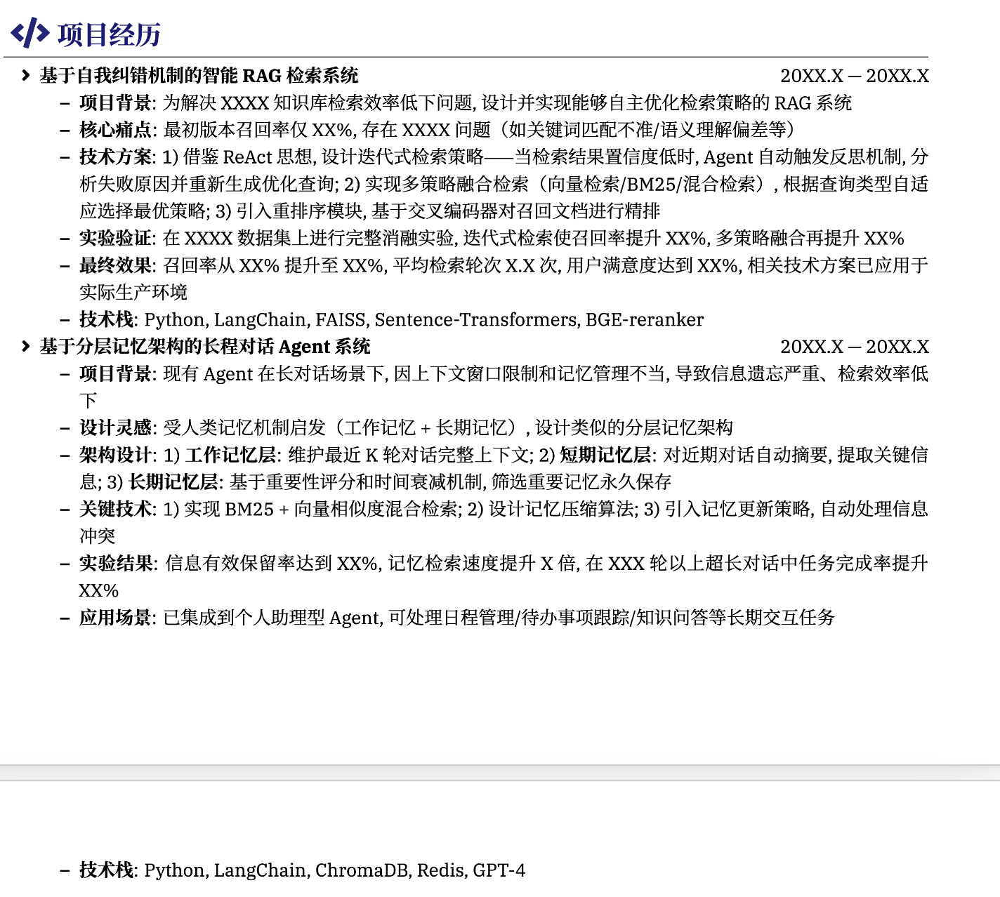

# 简历与面试

> 工作稿，后续统一在这份文件上修改。
> 当前目标：把 `主项目` 和 `补充项目` 拆成两条独立简历项目。
> 当前口径以 2026-03-16 的仓库文档、代码与输出文件为准。

---

## 一、使用原则

- `主项目`：已经完成，可以作为简历主打项目来写。
- `补充项目`：**没有完全完成**，只能写成 `部分完成 / in progress`。
- 两个项目要分开写，不要混成一个“大项目”。

---

## 二、模块 A：主项目

### 1. 项目定位

建议项目名：

**LLM Alignment for Mathematical Reasoning**  
个人项目 | 2026.02 - 2026.03

一句话定义：

> 在 `Qwen2.5-Math-1.5B` 上从零实现 `SFT / Expert Iteration / GRPO` 对齐训练与评测闭环，提升数学推理能力。

### 2. 核心事实

| 阶段 | 方法 | 结果 |
|---|---|---|
| Baseline | Qwen2.5-Math-1.5B | `4.1%` |
| SFT | full train set | `18.9%` |
| Expert Iteration | `G=8, D_b=1024, E=2` | `21.9%` |
| GRPO | best run | `46.05%` |

关键发现：
- `masked_normalize` 明显优于 `masked_mean`
- off-policy GRPO 如果不做约束，容易出现 entropy collapse
- 小的 `KL penalty` 是稳定训练的关键
- `log_ratio` 在 `exp()` 前做 clamp 能避免数值爆炸

### 3. 简历写法

#### 中文版

- 在 `Qwen2.5-Math-1.5B` 上从零实现 `SFT / Expert Iteration / GRPO` 对齐训练流程，搭建基于 `PyTorch + Transformers + vLLM` 的 rollout、reward、评测与 checkpoint 闭环
- 通过 learning rate sweep、loss 设计、advantage normalization 与 KL regularization 等消融实验，将 MATH validation accuracy 从 `4.1%` 提升至 `46.05%`
- 定位并修复 off-policy GRPO 中的数值与稳定性问题，包括 `log-ratio` 爆炸、entropy collapse、clip 指标统计偏差和多 microbatch backward 问题

#### 英文版

- Built an end-to-end LLM alignment pipeline on `Qwen2.5-Math-1.5B`, implementing `SFT`, `Expert Iteration`, and `GRPO` with PyTorch-native training loops and vLLM-based rollout/evaluation
- Improved MATH validation accuracy from `4.1%` to `46.05%` through controlled ablations on learning rate, loss aggregation, KL regularization, and group-normalized rewards
- Debugged key RL training failures including importance-ratio explosion, entropy collapse, and microbatch graph reuse issues, then stabilized training with `log-ratio clamp`, `KL penalty`, and corrected masked loss aggregation

### 4. 30 秒介绍

> 这个项目是我在 `Qwen2.5-Math-1.5B` 上做的数学推理对齐实验。我从零实现了 `SFT`、`Expert Iteration` 和 `GRPO` 的训练与评测闭环，不是直接调用现成训练框架。通过一系列消融实验和稳定性修复，我把 MATH validation accuracy 从 `4.1%` 提高到了 `46.05%`。

### 5. 面试长版故事

> 这个主项目我想解决的问题其实很明确：小模型能不能通过对齐训练，真正提升数学推理能力，而不是只学会输出一个更像样的答案格式。为此我选了 `Qwen2.5-Math-1.5B` 作为研究对象，因为 1.5B 这个规模足够小，不同对齐方法的差异会更明显，也更容易看清训练稳定性问题。  
>   
> 我的做法不是直接跑某一个现成框架，而是先搭一个完整、可复现的训练和评测闭环。先从 baseline 开始，确认原始模型在 MATH validation 上只有 `4.1%`。然后我把三条路线都实现出来并做公平比较：第一条是 `SFT`，看监督微调能把模型拉到什么程度；第二条是 `Expert Iteration`，先对每道题生成多条回答，筛出高质量样本，再做下一轮监督训练；第三条是 `GRPO`，直接基于一组 rollout 的相对 reward 做优化。这里三种方法都是从同一个 base model 独立训练，不是串起来做，这样结果才可比。  
>   
> 前两条路线给了我一个很重要的判断。`SFT` 把准确率从 `4.1%` 提升到 `18.9%`，说明监督信号可以明显改善模型；`Expert Iteration` 进一步提升到 `21.9%`，说明通过生成再筛选优质样本确实能继续带来收益。但这个阶段我也逐渐意识到，SFT 和 EI 更多是在帮助模型学会“更像在做题”，而不一定足以把推理能力本身拉到更高水平。所以项目真正的重点转向了 `GRPO`。  
>   
> `GRPO` 这一部分是整个项目里最难也最有价值的地方。理论上它更适合这种任务，因为它不是单纯模仿正确答案，而是直接根据 reward 去优化同一道题的一组回答。不过真正的挑战不是把它跑起来，而是把它跑稳。我遇到过几个很关键的问题：第一，off-policy 设置下 `exp(log_ratio)` 会出现数值爆炸，梯度会飙到非常不正常的量级；第二，如果没有 `KL penalty`，模型在训练中后期会发生 entropy collapse，看起来局部验证集上的 accuracy 还在涨，但最终模型已经退化；第三，loss 的聚合方式影响比我预期的大，`masked_normalize` 和 `masked_mean` 会带来接近十个百分点级别的差异。  
>   
> 所以这个项目后半段本质上是在做训练稳定性分析。我通过一系列控制变量实验把问题逐步定位清楚：对 ratio 在 `exp()` 前做 clamp 来消掉数值爆炸；加小的 `KL penalty` 限制当前 policy 偏离 reference 太远，避免 collapse；再通过实验确认 `masked_normalize` 明显优于 `masked_mean`，因为在数学推理任务里，较长且正确的 reasoning chain 往往更有价值，这种聚合方式会让它们贡献更多梯度。除此之外，我还做了 learning rate sweep、loss type ablation、advantage normalization 等实验，确保最后的结论不是偶然调出来的最好点，而是有比较完整的证据链支撑。  
>   
> 最终结果是，baseline `4.1%`，SFT `18.9%`，Expert Iteration `21.9%`，最优 GRPO 在 full validation 上达到 `46.05%`。所以如果让我总结这个项目，我会说：我不是单纯比较了几个对齐算法，而是系统验证了小模型在不同对齐信号下的能力变化，并且把一套 RL-style alignment pipeline 从实现、调参到稳定性分析完整跑通了。这个项目让我最明确的结论是，在数学推理任务上，真正决定效果上限的，不只是“有没有用 RL”，而是你能不能把 RL 训练稳定住。

### 6. 面试必背数字

- `4.1 -> 18.9 -> 21.9 -> 46.05`
- 最优 EI：`G=8, D_b=1024, E=2`
- `masked_normalize` 带来约 `+10pp` 级别收益

### 7. 高频问题

#### Q1：SFT、EI、GRPO 分别是什么？

- SFT 是监督学习
- EI 是 rollout 筛选优质样本再做 SFT，本质上是 rejection sampling + SFT
- GRPO 是 group-based policy optimization，用组内相对 reward 做 advantage，不需要单独训练 value model

#### Q2：为什么 GRPO 比 EI 强很多？

- EI 只保留正确样本，对错误样本利用不足
- GRPO 直接优化 reward，保留组内比较信息
- 从结果看 EI 最好 `21.9%`，GRPO 到 `46.05%`

#### Q3：主项目最值得讲的坑是什么？

- 没有 KL 惩罚时会发生 entropy collapse
- 小验证集可能“看起来在涨”，但 full eval 已经异常
- 说明 RL 训练不能只看单一 accuracy，要结合 entropy、KL 和全量评测一起看

### 8. 不要说错的点

- 主项目是完整完成的
- 主项目最强数字是 `46.05%`
- 不要把主项目说成“只是跑了课程代码”

---

## 三、模块 B：补充项目

### 1. 项目定位

建议项目名：

**RLHF and Safety Alignment Pipeline on Llama-3.1-8B**  
个人项目（补充项目，进行中） | 2026.03 -

一句话定义：

> 在 `Llama-3.1-8B` 上部分实现 RLHF 流程，覆盖 zero-shot baseline、`QLoRA SFT`、`DPO`、以及 `MMLU / GSM8K / SST` 评测与安全性分析。

### 2. 核心事实

准确口径：

- 核心流程已经跑通
- 已经有阶段性结果
- 但整体 **没有完全完成**

当前结果：

#### zero-shot baseline

- MMLU：`0.00%` (`0/14042`)
- GSM8K：`0.00%` (`0/1319`)
- SST safe rate：当前记录口径为 `0/100`
- AlpacaEval baseline：`0.0% win rate`

#### SFT 后

- MMLU：`22.82%` (`3205/14042`)
- GSM8K：`1.90%` (`25/1319`)
- SST safe rate：`36%`

#### DPO 后

- HH validation accuracy：`0.34`
- MMLU：`22.18%` (`3114/14042`)
- GSM8K：`2.12%` (`28/1319`)
- SST safe rate：`42%`

### 3. 补充项目最该突出什么

- 你把 base model 从几乎不会 follow instruction 的状态，推进到了可评测、可对齐的状态
- 你补齐了 RLHF 流程里的多块工程：prompt、stop sequence、parser、评测、QLoRA、merge/dequantize、DPO
- 你解决了多个典型工程问题：prompt mismatch、token degeneration、vLLM 与量化 checkpoint 不兼容、`max_model_len` OOM

### 4. 简历写法

#### 中文版

- 在 `Llama-3.1-8B` 上实现并验证部分 RLHF 流程，覆盖 zero-shot baseline、`QLoRA SFT`、`DPO` 训练以及 `MMLU / GSM8K / SST` 评测脚本
- 修复 base model 在 zero-shot prompt 下的生成退化问题，补齐 system prompt、stop sequence、parser 和 `max_model_len` 设置，并解决 4-bit checkpoint 与 vLLM 评测不兼容问题
- SFT 后 MMLU 提升至 `22.82%`，DPO 将 SST safe rate 从 `36%` 提升到 `42%`，同时保持 MMLU / GSM8K 基本稳定

#### 英文版

- Built a partially completed RLHF pipeline on `Llama-3.1-8B`, covering zero-shot evaluation, `QLoRA SFT`, `DPO`, and benchmark scripts for `MMLU`, `GSM8K`, and `SST`
- Fixed prompt-format mismatch and deployment issues by adding system prompts, stop sequences, parsers, `max_model_len` constraints, and merge/dequantize utilities for vLLM compatibility
- Reached `22.82%` on MMLU after SFT and improved SST safe rate from `36%` to `42%` after DPO while keeping MMLU/GSM8K roughly stable

### 5. 30 秒介绍

> 这个补充项目是在 `Llama-3.1-8B` 上做的部分 RLHF 流程实现。我完成了 zero-shot baseline、`QLoRA SFT`、`DPO` 和多项评测脚本，重点不是把指标做到特别高，而是把一个 base model 从 prompt 不适配、几乎无法正常评测的状态，推进到可以做 instruction tuning 和 preference optimization 的状态。

### 6. 面试必背数字

- MMLU：`0.00% -> 22.82% -> 22.18%`
- GSM8K：`0.00% -> 1.90% -> 2.12%`
- SST safe rate：`0% -> 36% -> 42%`
- DPO HH val accuracy：`0.34`
- AlpacaEval baseline：`0.0% win rate`

### 7. 高频问题

#### Q1：为什么 baseline 是 0？

- 因为 base model 对 zero-shot prompt 格式不适配
- 它不是“不会做题”，而是先出现了 token degeneration，导致输出无法解析
- 先把 prompt、stop sequence 和 parser 修好，后面的训练和评测才有意义

#### Q2：为什么这里要用 QLoRA？

- 模型是 `Llama-3.1-8B`
- QLoRA 让 8B 模型在有限显存下可训练
- 对补充项目来说，这是务实的工程选择

#### Q3：DPO 带来了什么？

- 它主要改善了安全性和偏好行为
- SST safe rate 从 `36%` 提到 `42%`
- 对 MMLU 和 GSM8K 的影响很小，说明它不是主要用来提升基础能力

#### Q4：为什么补充项目不能说完成了？

- 因为我已经把核心流程跑通并拿到了阶段性结果，但整体 supplement 还没到 fully finished 的状态
- 所以我会诚实地说它是部分完成、持续推进中

### 8. 不要说错的点

- 补充项目**不是**完整完成
- `0.34` 是 DPO 的 preference validation accuracy，不是 MMLU 或 GSM8K
- 不要说 AlpacaEval 已经拿到了很漂亮的提升结论

---

## 四、两个项目一起上简历时怎么摆

建议顺序：

1. 主项目放前面
2. 补充项目放后面

原因：
- 主项目结果更强、完成度更高，适合作为主打项目
- 补充项目更适合体现 RLHF / safety / evaluation / infra 经验

一句话区分：
- 主项目回答“我会搭和调 LLM 对齐训练”
- 补充项目回答“我会把 RLHF 和安全评测链路落到 8B 模型上”

---

## 五、后续继续补什么

- 更适合一页简历的精简版 bullet
- `MLE / LLM Engineer / Research Intern` 三种岗位版本
- 英文自我介绍版本
- 两个项目各自的 90 秒版口述
- 如果补充项目后续收尾，再补最终口径和新结果

