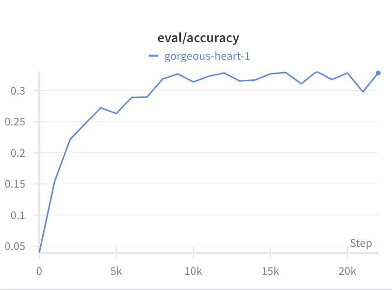
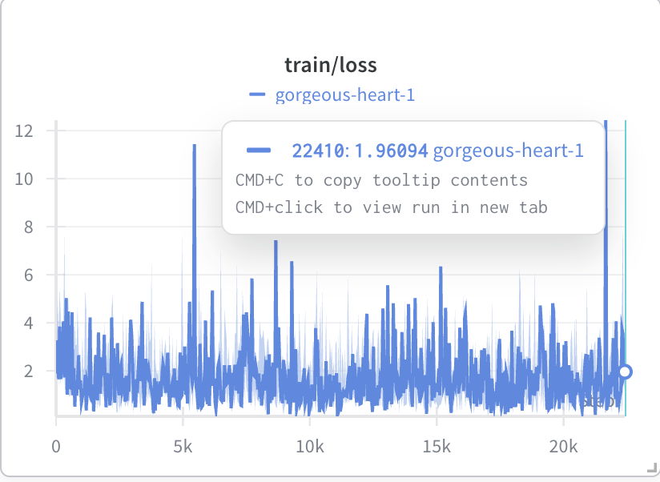
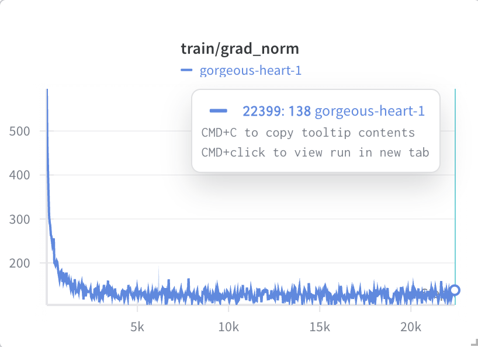
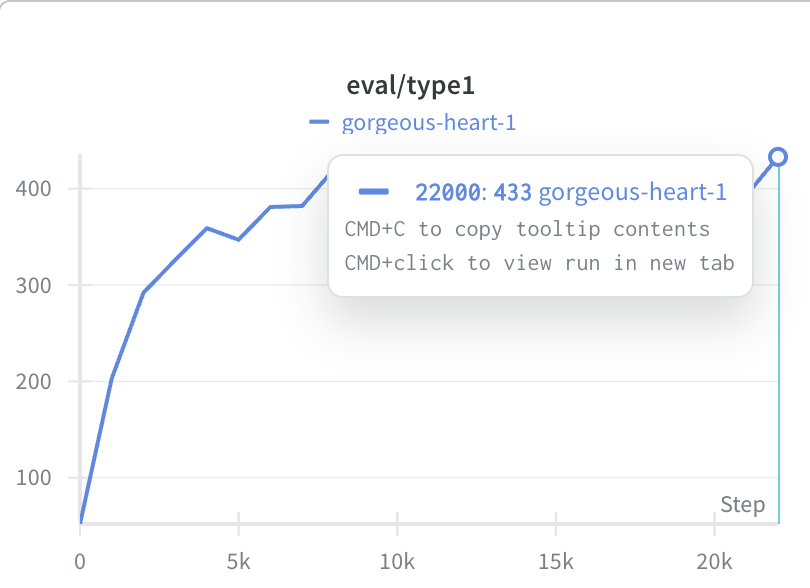
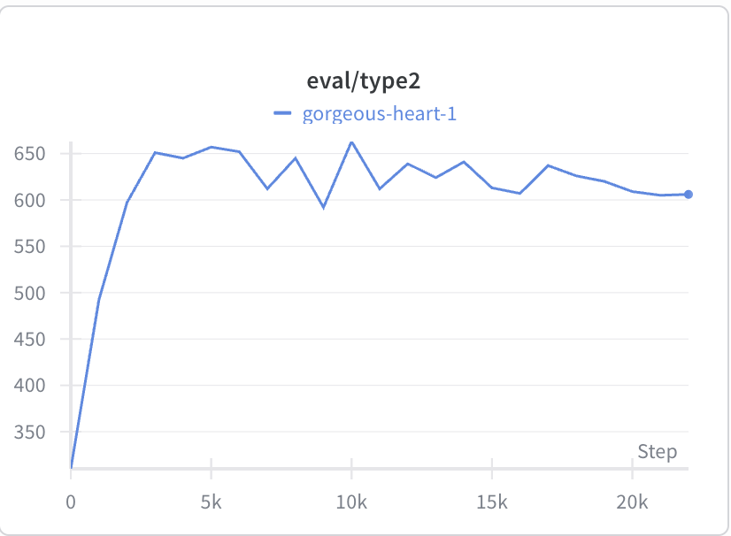
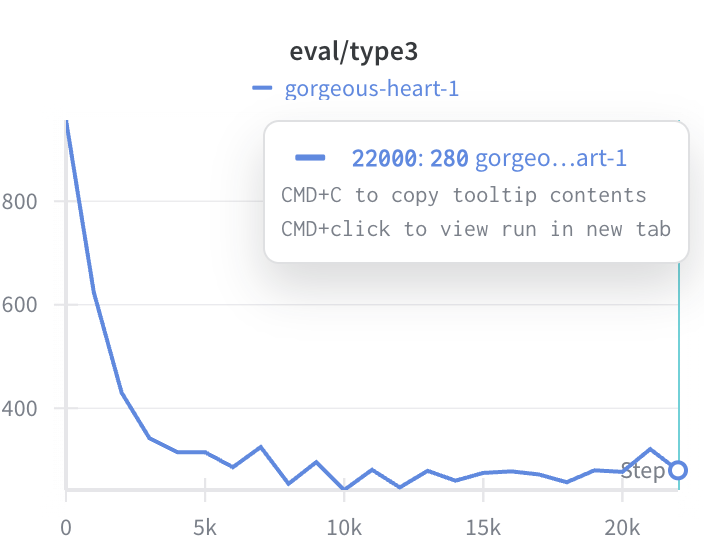

# 说明

本文件用于记录我在 `CS336 Assignment 5 (Alignment)` 中已经完成的关键内容，按题目模块整理。  
格式参考 `作业完成笔记.md`，但结论与数据均来自我自己的实验与代码。

---

## math_baseline P6

代码位置：`cs336_alignment/math_baseline.py`

在 GSM8K test（`1319` 条）上评估 `Qwen2.5-Math-1.5B` 的 zero-shot baseline，使用课程给定的 `r1_zero_reward_fn` 判分。

### 主要结果（2026-02-14）

- accuracy: `0.0348749052`（约 `3.49%`）
- format_reward: `0.2934040940`（约 `29.34%`）
- type1（格式正确+答案正确）: `46`
- type2（格式正确+答案错误）: `341`
- type3（格式错误）: `932`

### 学到的点

- base 模型在 `<think> ... </think> <answer> ... </answer>` 这种强格式约束下，输出稳定性明显不足。
- 很多样本并不是“不会做题”，而是“格式不合格直接判 0”。
- baseline 很低是正常现象，后续 SFT 的提升空间很大。

---

## tokenize_prompt_and_output P9

代码位置：`cs336_alignment/utils.py`

实现了 prompt/output 分开 tokenize，再拼接并构建 `response_mask` 的逻辑。

### 关键细节

- `response_mask` 只在 output 对应 token 位置为 `1`，prompt 和 padding 为 `0`。
- `labels` 的 padding 用 `-100`，避免计入 loss。
- `input_ids` 与 `labels` 是 shift 对齐关系：
  - `input_ids = full_ids[:, :-1]`
  - `labels = full_ids[:, 1:]`

### 这题最容易错的地方

- 必须先把每条样本 pad 到同长度，再做左右截断；不能先截断再 pad。

---

## compute_entropy P10

代码位置：`cs336_alignment/utils.py`

实现 logits 最后一维分布的信息熵计算。

### 学到的点

- 需要用稳定数值写法（`log_softmax`）避免直接 softmax 溢出。
- 熵越高说明预测越不确定；可以作为训练稳定性观察指标之一。

---

## get_response_log_probs P10

代码位置：`cs336_alignment/utils.py`

实现了给定 `input_ids/labels` 后，按 label token 位置提取 log-prob，并可选返回 token entropy。

### 学到的点

- 这是后续 SFT/GRPO 损失计算的基础接口。
- 张量 shape 和 shift 对齐一旦错一位，后面所有 loss 都会错。

---

## masked_normalize P11

代码位置：`cs336_alignment/utils.py`

实现 masked 求和与归一化，确保只在有效 token 上聚合统计。

### 学到的点

- 要保持可微分，不能用破坏梯度的 in-place 写法去“硬清零”。

---

## sft_microbatch_train_step P12

代码位置：`cs336_alignment/utils.py`

实现了 micro-batch 的单步反向传播逻辑，支持 gradient accumulation。

### 关键点

- loss 需要除以 `gradient_accumulation_steps` 再 `backward()`，否则梯度会放大。
- 每次 `optimizer.step()` 后再 `zero_grad()`。

---

## sft_experiment P14

代码位置：`cs336_alignment/sft.py`

按照课程思路完成了 SFT 主训练流程，并在训练中周期性调用 vLLM 做评估。

### 本实验和题目要求的对应关系

- 题目原始数据是 MATH；我这边按项目实际使用 GSM8K（课程仓库中也支持这一替代流程）。
- 评估集使用 `data/gsm8k/test.jsonl`，每 `1000` step 评估一次。
- 使用 `clip_grad_norm_(..., 1.0)` 做梯度裁剪。

### 训练结果（本轮 full run）

- 总 step：`22410`
- 评估点：`0, 1000, ..., 22000`（共 23 个）
- 最终 accuracy（step=22000）：`0.3282789992`（`32.83%`）
- 最佳 accuracy（step=18000）：`0.3305534496`（`33.06%`）
- 最终 type 统计（step=22000）：
  - type1: `433`
  - type2: `606`
  - type3: `280`

### 结果观察

- 从 baseline 的 `3.49%` 提升到 `32%+`，提升非常明显。
- 后期曲线进入平台期（约 `31%~33%`），瓶颈主要在 type2（格式对但答案错）仍偏高。

### 曲线截图

---

## 工程排错记录（本次最关键）

1. `ModuleNotFoundError: No module named 'utils'`
   - 原因：`tests/adapters.py` 中使用了错误导入路径。
   - 处理：统一改为包内路径导入（`cs336_alignment.utils`）。

2. `NameError: PreTrainedModel is not defined`
   - 原因：类型注解用到 `PreTrainedModel` 但未正确 import。
   - 处理：补正确 import，并修正误用中文逗号导致的语法错误。

3. `TypeError: exceptions must derive from BaseException`
   - 原因：把 `raise utils.compute_entropy(...)` 写成抛异常。
   - 处理：改成 `return utils.compute_entropy(...)`。

4. `CUDA out of memory`
   - 原因：单卡显存不足或 batch 设置偏大。
   - 处理：减小 micro batch + 梯度累积；训练/评估分离 GPU。

5. W&B online 同步失败（`ProxyError`）
   - 原因：集群代理网络限制。
   - 处理：改用 offline 记录，后续再手动 sync 或导出。

---

## 当前进度总结

- [x] baseline 评估跑通（GSM8K）
- [x] SFT 核心函数实现并通过对应测试
- [x] SFT 训练 + vLLM 周期评估跑通
- [x] 达到并超过题目 `15%` 准确率目标（当前约 `33%`）
- [ ] 继续做数据规模 ablation（128/256/512/1024/full）
- [ ] 做 filtered SFT 对比实验（仅保留回答正确样本）
